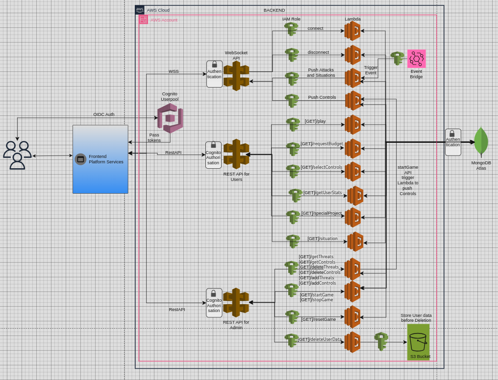

# Design of the Back-end of a Cybersecurity Decision-Making Game

## Abstract
As cyber attacks become increasingly frequent and sophisticated, organizations face a growing need for professionals who can effectively manage cybersecurity. However, a significant gap exists between the knowledge acquired through traditional education and the practical decision-making skills required in real-world scenarios. We proposes the development of a cybersecurity game designed to bridge this gap by simulating real-world challenges and teaching professionals decision-making skills in a simulated organizational environment. The game’s backend architecture is designed using AWS serverless services, Python, MongoDB, APIs, and robust security measures to ensure its scalability and performance. It incorporates various scenarios, such as random attacks, budget constraints, control degradation, imperfect controls, and risk assessment, along with special projects and situational decision-making. The backend facilitates decision-making processes by generating cyber attacks, managing budget constraints, simulating control degradation, implementing imperfect controls, incorporating risk assessment, and presenting situational decision-making. By tracking metrics like organization uptime, attack success rates, financial impact, and budget allocation, the game enables players to understand the consequences of their decisions and develop practical skills in managing cybersecurity. The proposed game has the potential to enhance the overall cybersecurity posture of organizations by better preparing professionals for the complex challenges they will encounter in their roles and promoting informed decision-making across various levels of the organization.

## Architecture Diagram of the Backend
